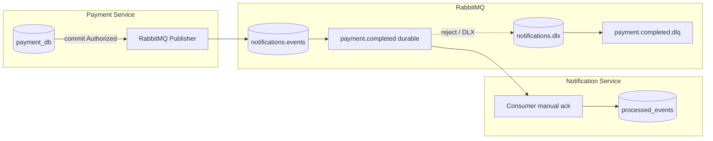

# Architecture Documentation

## System Architecture

### Overview
The system has been migrated from a pure REST architecture to a hybrid REST/gRPC architecture, maintaining backward compatibility while adding the benefits of gRPC for inter-service communication.

### Components

#### 1. Payment Service
- **Primary Protocol**: gRPC (internal communication)
- **Secondary Protocol**: HTTP/REST (backward compatibility)
- **Port**: 50051 (gRPC), 8081 (HTTP)
- **Database**: PostgreSQL (payment_db)

#### 2. Order Service
- **External Protocol**: HTTP/REST (client-facing API)
- **Internal Protocol**: gRPC (payment service communication)
- **Streaming Protocol**: gRPC (order status updates)
- **Port**: 8080 (HTTP), 50052 (gRPC Streaming)
- **Database**: PostgreSQL (order_db)

#### 3. Notification Service (Assignment 3)
- **Protocol**: AMQP consumer only (no calls to Order/Payment)
- **Broker**: RabbitMQ (`notifications.events` → `payment.completed` queue)
- **Database**: PostgreSQL (`notification_db`) for idempotent `event_id` tracking
- **Ports**: none exposed by default (runs inside Docker network)

#### 4. Message Broker
- **RabbitMQ**: durable exchanges/queues, publisher confirms, manual consumer ACKs, optional DLQ (`payment.completed.dlq`)

#### 5. Streaming Client
- **Protocol**: gRPC (order status streaming)
- **Purpose**: Demonstrate real-time capabilities

### Communication Flow

```
External Client
    |
    v HTTP/REST
+-------------------+
|  Order Service    |
|  (HTTP:8080)      |
+--------+----------+
         |
         | gRPC (Payment Processing)
         v
+-------------------+
| Payment Service   |
| (gRPC:50051)      |
+--------+----------+
         |
         | AMQP topic "payment.completed"
         | (JSON events, persistent + publisher confirms)
         v
+-------------------+
| RabbitMQ          |
| notifications.events
+--------+----------+
         |
         | durable queue + manual ack
         v
+-------------------+
| Notification Svc  |
| (consumer only)   |
+-------------------+

Streaming Client
    |
    v gRPC
+-------------------+
|  Order Service    |
| (Streaming:50052) |
+-------------------+
```

### Event-Driven Notifications (Assignment 3)

After the payment row is committed and status is **Authorized**, the Payment service publishes a JSON event to the durable topic exchange `notifications.events` with routing key `payment.completed`. Publisher confirms ensure the broker accepted the message before the gRPC call succeeds.

The Notification service binds a durable queue `payment.completed` with dead-lettering to `notifications.dlx` / queue `payment.completed.dlq`. It consumes with **manual acknowledgements** (`auto-ack` disabled): `Ack` only after the simulated email line is logged and the event id is stored for idempotency. Poison messages or the optional DLQ demo path use `Nack(false, false)` so RabbitMQ dead-letters them.



## Protocol Buffer Design

### Payment Service Proto
```protobuf
service PaymentService {
  rpc AuthorizePayment(AuthorizePaymentRequest) returns (AuthorizePaymentResponse);
  rpc GetPaymentStatus(GetPaymentStatusRequest) returns (GetPaymentStatusResponse);
}
```

### Order Service Proto
```protobuf
service OrderService {
  rpc SubscribeToOrderUpdates(OrderRequest) returns (stream OrderStatusUpdate);
}
```

## Clean Architecture Preservation

### Domain Layer
- **Unchanged**: Business logic and entities remain the same
- **Payment Domain**: Payment entity, status constants
- **Order Domain**: Order entity, status constants

### Use Case Layer
- **Unchanged**: Core business operations
- **Payment Use Cases**: AuthorizePayment, GetPaymentByOrder
- **Order Use Cases**: CreateOrder, GetOrder, CancelOrder

### Repository Layer
- **Unchanged**: Data access interfaces
- **Implementation**: PostgreSQL repositories

### Adapter Layer
- **Modified**: Payment adapter changed from HTTP to gRPC
- **New**: gRPC client implementation

### Transport Layer
- **Enhanced**: Added gRPC server implementations
- **Preserved**: HTTP handlers for external API

## Database Schema

### Orders Table
```sql
CREATE TABLE orders (
    id VARCHAR(255) PRIMARY KEY,
    customer_id VARCHAR(255) NOT NULL,
    item_name VARCHAR(255) NOT NULL,
    amount BIGINT NOT NULL,
    status VARCHAR(50) NOT NULL,
    created_at TIMESTAMP WITH TIME ZONE NOT NULL
);
```

### Payments Table
```sql
CREATE TABLE payments (
    id VARCHAR(255) PRIMARY KEY,
    order_id VARCHAR(255) NOT NULL,
    transaction_id VARCHAR(255) NOT NULL,
    amount BIGINT NOT NULL,
    status VARCHAR(50) NOT NULL,
    created_at TIMESTAMP WITH TIME ZONE NOT NULL
);
```

## Streaming Implementation

### Real-time Database Monitoring
- **Polling Interval**: 500ms
- **Change Detection**: Status comparison
- **Notification**: Push to all subscribers

### Subscriber Management
- **Multi-subscriber Support**: Multiple clients per order
- **Graceful Disconnection**: Proper cleanup
- **Error Handling**: Stream error recovery

## Error Handling Strategy

### gRPC Status Codes
- **InvalidArgument**: Invalid input parameters
- **NotFound**: Order/payment not found
- **Internal**: Server-side errors
- **Unavailable**: Service connectivity issues

### Use Case Error Mapping
- **ErrPaymentUnavailable**: gRPC Unavailable/DeadlineExceeded
- **ErrPaymentNotFound**: gRPC NotFound
- **ErrPaymentAlreadyRecorded**: gRPC AlreadyExists

## Configuration Management

### Environment Variables
- **Database URLs**: Connection strings
- **Service Addresses**: gRPC/HTTP endpoints
- **No Hardcoding**: All addresses configurable

### Default Values
- **Payment gRPC**: :50051
- **Order HTTP**: :8080
- **Order Streaming**: :50052
- **Payment HTTP**: :8081

## Deployment Considerations

### Service Dependencies
- **Order Service** depends on **Payment Service**
- **Both services** depend on **PostgreSQL**
- **Streaming Client** depends on **Order Service**

### Startup Order
1. PostgreSQL databases
2. Payment Service
3. Order Service
4. Streaming Client (optional)

### Health Checks
- **HTTP Endpoints**: Service health
- **gRPC Connections**: Service availability
- **Database**: Connection status

## Performance Characteristics

### gRPC Benefits
- **Binary Protocol**: More efficient than JSON
- **Generated Code**: Type-safe interfaces
- **Streaming**: Real-time capabilities

### Streaming Performance
- **Low Latency**: 500ms polling interval
- **Scalable**: Multiple subscribers per order
- **Efficient**: Push-based notifications

## Security Considerations

### Current Implementation
- **Insecure Connections**: Development mode
- **No Authentication**: Simplified for assignment
- **Database Security**: Connection strings

### Production Recommendations
- **TLS/mTLS**: Secure gRPC connections
- **Authentication**: JWT or similar
- **Authorization**: Service-to-service auth
- **Database Security**: Connection pooling, encryption

## Monitoring and Observability

### Logging
- **gRPC Interceptor**: Request/response logging
- **Method Names**: Operation tracking
- **Duration**: Performance metrics

### Metrics (Future Enhancement)
- **Request Count**: Operation frequency
- **Error Rates**: Failure tracking
- **Response Times**: Performance monitoring
